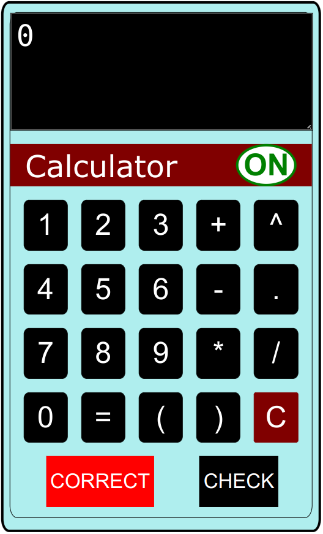

# A Javascipt Calculator

<ul>
    <li> This is a calculator made using Javascript. </li>
    <li> It can also evaluate mathematical expressions using according to the precedence of the operators. </li>
</ul>

   
